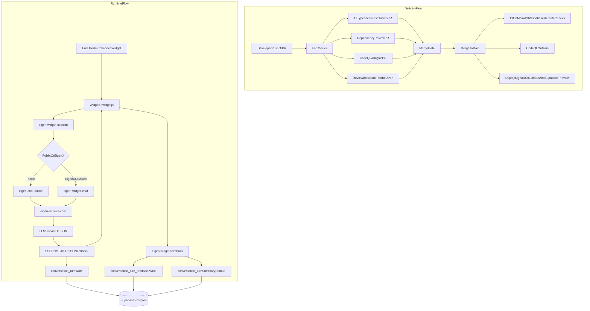
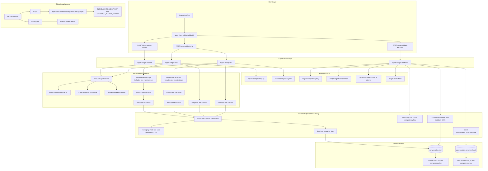

# Current-State Visual Representation

## Goal

Provide a complete current-state view of:

- Delivery flow (`PR -> merge -> main checks -> security/deploy signals`)
- Runtime flow (`Widget -> Edge Functions -> Retrieval -> Observability/Feedback`)

## Scope Captured

- Delivery workflows:
  - `.github/workflows/ci.yml`
  - `.github/workflows/codeql.yml`
- Runtime paths:
  - `apps/eigen-widget/widget.js`
  - `supabase/functions/eigen-widget-chat/index.ts`
  - `supabase/functions/eigen-chat-public/index.ts`
  - `supabase/functions/eigen-widget-feedback/index.ts`
  - `supabase/functions/_shared/conversation-turn.ts`
  - `supabase/migrations/202604180003_conversation_turn_observability.sql`
  - `supabase/migrations/202604180004_conversation_turn_idempotency_keys.sql`

## Unified Current-State Diagram (High-Level)

## Technical-Depth Diagram

## What This Means Today

- Merges are protected by PR rules and validated again on `main`.
- CodeQL runs on PRs and `main`, and uploads code scanning results.
- Widget runtime supports SSE streaming and JSON fallback.
- Observability writes are centralized through shared conversation-turn helpers.
- Idempotency keys are enforced for write paths to reduce duplicate rows on retries.

## How To Use This Representation

1. Start with the high-level diagram to orient around delivery versus runtime.
2. Use the technical-depth diagram to trace one request end-to-end:
   - widget request entry,
   - auth/idempotency guard,
   - retrieval/synthesis path,
   - observability write path,
   - feedback write/repair path.
3. Use CI/security lane to validate release readiness:
   - `CI` run on `main` green,
   - `CodeQL` run on `main` green,
   - Supabase remote drift/type checks green.
4. For incident triage:
   - request issue: inspect runtime and guard lanes,
   - data mismatch issue: inspect observability and feedback repair lanes,
   - release issue: inspect delivery and CI/security lanes.

## Demo Walkthrough

### Demo A: Delivery Pipeline

1. Open a recent PR.
2. Show required checks (CI, dependency review, CodeQL, review bots).
3. Merge to `main`.
4. Show post-merge `main` runs for CI and CodeQL.

### Demo B: Runtime Request

1. Open widget in public mode.
2. Submit a prompt.
3. Show streaming response behavior and fallback compatibility.
4. Show citations and retrieval-plan disclosure rendering.

### Demo C: Feedback + Idempotency

1. Submit feedback for a completed turn.
2. Repeat submission with same idempotency key (retry simulation).
3. Show dedupe behavior (no duplicate feedback row) and summary-field repair on turn row.

